# 🇹🇷

## 📝 NotesAppCompose

Modern Android mimarisi kullanılarak Kotlin ve Jetpack Compose ile geliştirilen, sade ve güçlü bir not alma uygulaması. Notlarınızı koruyabilir, arayabilir, sıralayabilir, silebilir ve sildiğiniz notları geri alabilirsiniz. Uygulama Clean Architecture prensiplerine göre yapılandırılmıştır.

## 🎯 Özellikler

- ✏️ Not oluşturma, düzenleme ve silme
- 🔍 Başlığa veya içeriğe göre not arama
- 🔃 Tarih veya başlığa göre sıralama (artan/azalan)
- 👆 Buton ile tekil bir notu silebilme ve **Geri Al (Undo)** özelliği
- 🔐 Notları PIN ile koruma
- 🗑️ Tüm notları toplu olarak silme
- 🎞️ Kayıt sırasında Lottie animasyonu
- 💾 Notlar Room veritabanında saklanır
- 💡 Kotlin Flow ile gerçek zamanlı güncellemeler

## 🧱 Teknoloji ve Mimariler

- **Kotlin**
- **Jetpack Compose (Material3, UI Tooling, Animasyonlar)**
- **MVVM + Clean Architecture** (Katmanlı yapı: Domain, Data, Presentation)
- **Room** veritabanı
- **Hilt** ile bağımlılık enjeksiyonu
- **Navigation Compose**
- **Coroutine & Flow** desteği
- **DataStore** ile PIN saklama
- **Lottie Compose** animasyonlar için

## 📦 Kullanılan Kütüphaneler

| Kütüphane          | Açıklama                   |
| ------------------ | -------------------------- |
| Jetpack Compose    | Arayüz oluşturma           |
| Material3          | Modern tasarım bileşenleri |
| Room               | Yerel veritabanı           |
| Hilt               | Bağımlılık enjeksiyonu     |
| Navigation Compose | Sayfalar arası geçiş       |
| Coroutine & Flow   | Asenkron ve reaktif yapı   |
| DataStore          | Kalıcı veri saklama (PIN)  |
| Lottie Compose     | Animasyonlar               |

## 🔮 Gelecek Özellikler

- 🖼️ Notlara görsel ekleme
- ⏰ Hatırlatma bildirimleri
- ☁️ Cloud senkronizasyonu / yedekleme

## 🚀 Kurulum

### 🔧 Gereksinimler

- Android Studio Hedgehog veya üstü
- Kotlin 1.9+
- Gradle Kotlin DSL

### 📥 Projeyi Klonla

```bash
git clone https://github.com/WhiteWolfSoft/NotesAppCleanArchitecture.git
```

### ▶️ Uygulamayı Çalıştır

1. Android Studio ile projeyi açın
2. Gradle senkronizasyonunun tamamlanmasını bekleyin
3. Gerçek cihaz veya emülatörde çalıştırın

> ✅ Minimum SDK: 21


## 📸️️️️ Ekran Görüntüleri

### 🗒️ Not Listesi - Sıralama

<div align="left">
  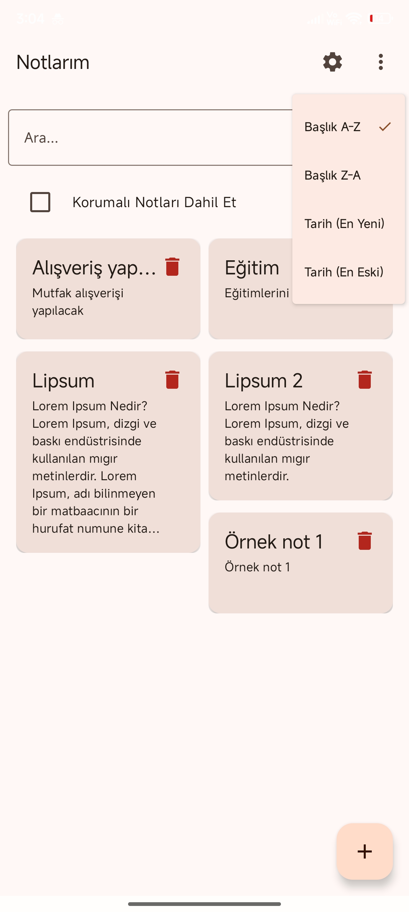
</div>

---

### ➕ Not Ekle / Düzenle


<div align="left">
  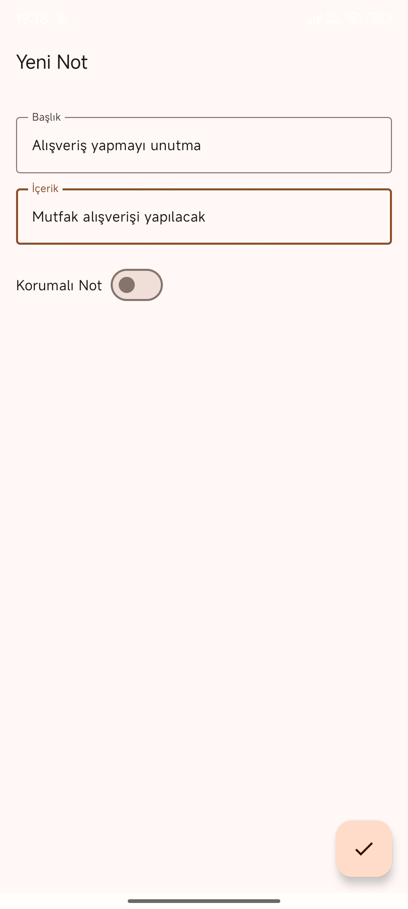
  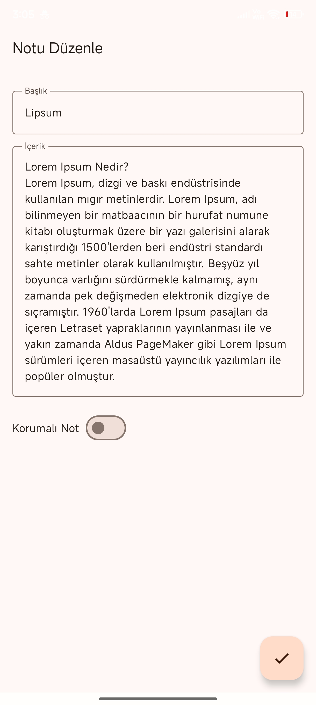
</div>

---

### 🔐 PIN Korumalı Notlar

<div align="left">
  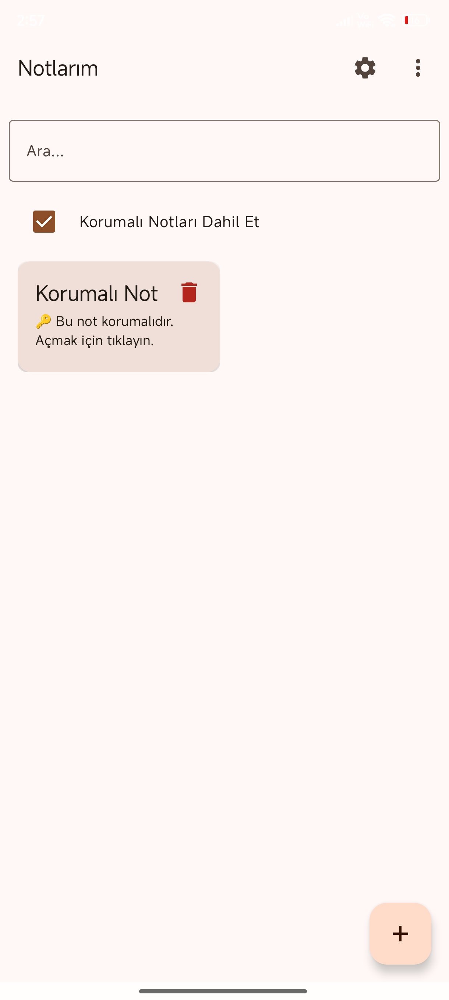
  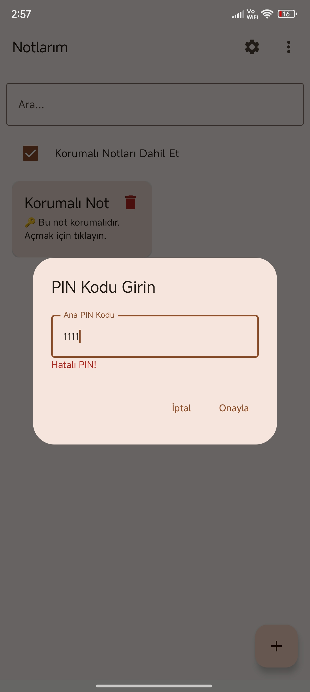
</div>


---

### ⚙️ PIN Ayarları

<div align="left">
  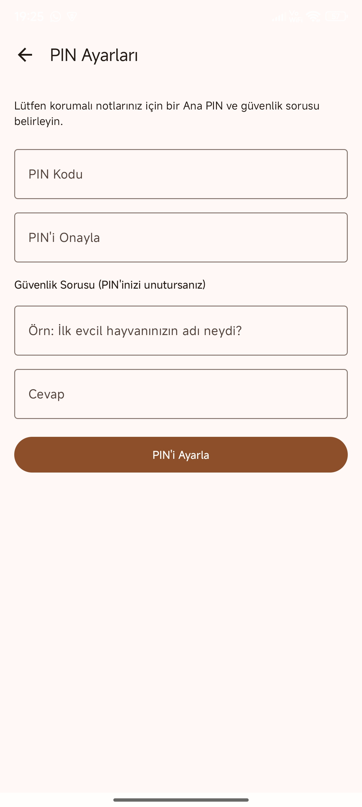
  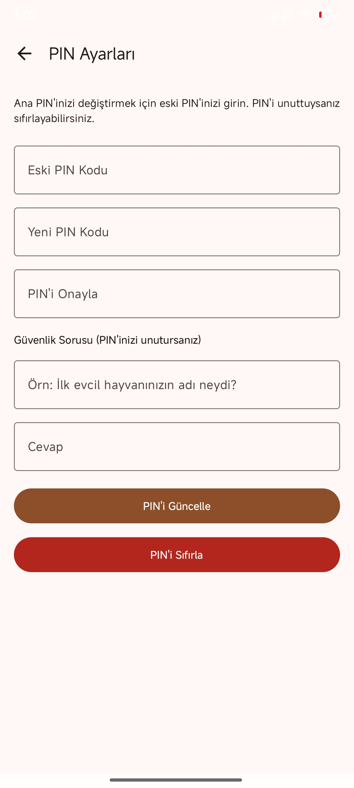
  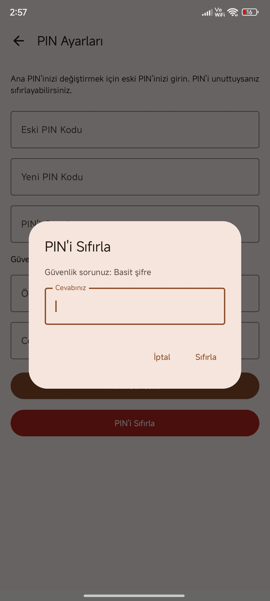
  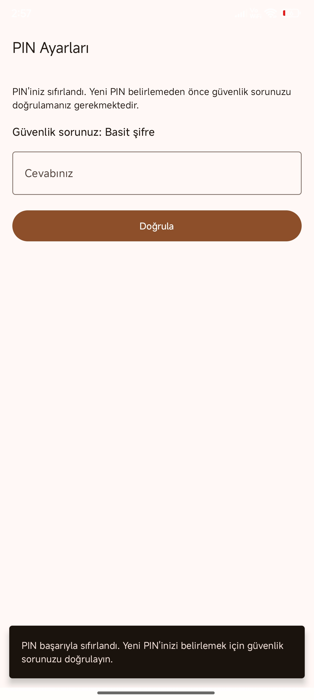
</div>

---

### 🗑️↩️ Not Silme - Geri Alma

<div align="left">
  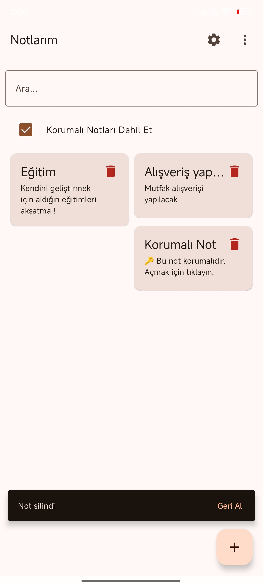
  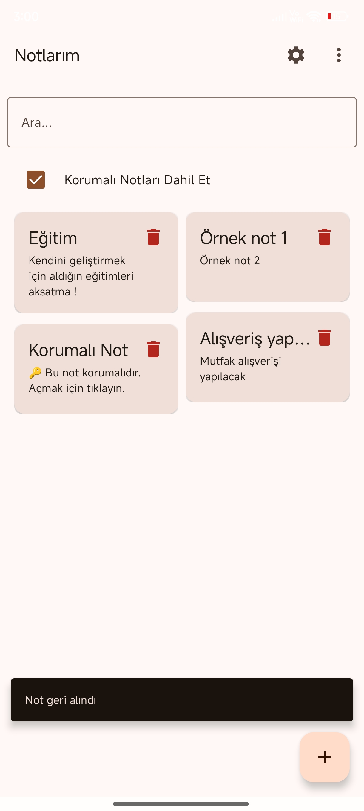
</div>

---

### 🔎 + ✅🗑️ Not Arama - Toplu Silme

<div align="left">
  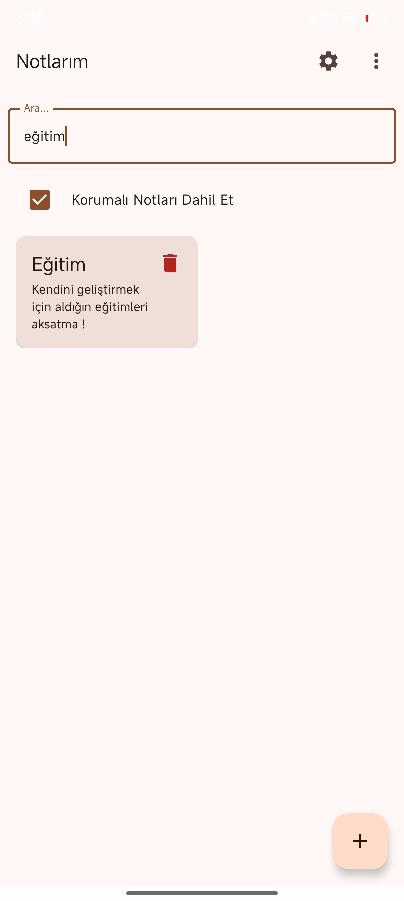
  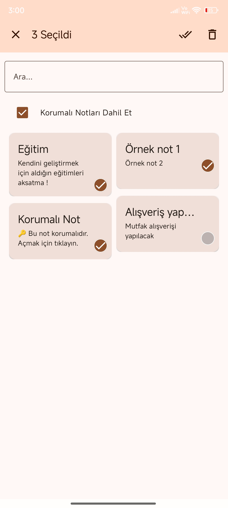
</div>

---

### 💾 Not Kaydetme Animasyonu GIF

<div align="left">
  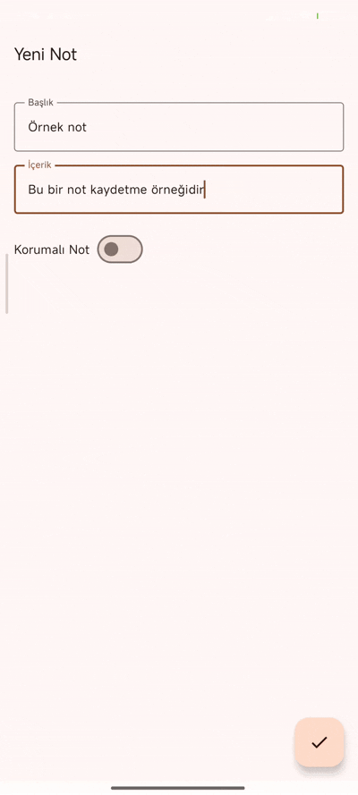
</div>

---

## 🤝 Katkı Sağlamak

Katkılarınızı memnuniyetle karşılıyoruz!

1. Bu repoyu fork'layın
2. Yeni bir branch oluşturun: `git checkout -b ozellik/YeniOzellik`
3. Değişiklikleri commit'leyin: `git commit -m 'Yeni özellik eklendi'`
4. Branch’i push’layın: `git push origin ozellik/YeniOzellik`
5. Pull Request açın

## 📄 Lisans

Bu proje [MIT Lisansı](LICENSE) ile lisanslanmıştır.

## 👤 Geliştirici

Bu uygulama [**WhiteWolfSoft**](https://github.com/WhiteWolfSoft) tarafından geliştirilmiştir.\
Her türlü geri bildirime açığım!

---

# 🇪🇳

# 📝 NotesAppCompose

A modern note-taking app built entirely with **Jetpack Compose**, following **Clean Architecture** principles. This app offers a clean and intuitive UI with advanced features such as note protection with PIN, undoable deletions, Lottie animations, and more.

## 🎯 Features

- ✏️ Create, edit, and delete notes
- 🔍 Search notes by title and content
- 🔃 Sort notes by date or title (ascending/descending)
- 👆 Button-to-delete with **Undo** via Snackbar
- 🔐 Protect individual notes with a **PIN code**
- 🗑️ Bulk delete all notes
- 🎞️ Lottie animation on save
- 💾 Notes stored locally using Room database
- 💡 Real-time updates using Kotlin Flow

## 🧱 Tech Stack

### 📚 Architecture

- **MVVM (Model-View-ViewModel)**
- **Clean Architecture** (Domain, Data, Presentation layers)
- **Single Activity Architecture**

### 🛠️ Core Technologies

- **Kotlin**
- **Jetpack Compose** (Material 3, UI Toolkit, Animations, Tooling)
- **Room** (local database)
- **Hilt** (for Dependency Injection)
- **Navigation Compose**
- **Kotlin Coroutines & Flow**
- **DataStore Preferences** (for persistent PIN storage)
- **Lottie Compose** (for save animation)


## 📦 Dependencies

| Library                  | Purpose                            |
| ------------------------ | ---------------------------------- |
| Jetpack Compose          | UI Framework                       |
| Material3                | Modern Material Design components  |
| Room                     | Local database                     |
| Hilt                     | Dependency Injection               |
| Navigation Compose       | Navigation between screens         |
| Kotlin Coroutines / Flow | Async and reactive data handling   |
| DataStore                | Key-value persistent storage (PIN) |
| Lottie Compose           | Animations on save                 |


## 🛠️ Planned Features

- 🖼️ Add image support to notes
- ⏰ Reminder notifications for notes
- ☁️ Cloud sync and backup support

## 🚀 Getting Started

### 🔧 Prerequisites

- Android Studio Hedgehog or higher
- Kotlin 1.9+
- Gradle with Kotlin DSL

### 📥 Clone the Repository

```bash
git clone https://github.com/WhiteWolfSoft/NotesAppCleanArchitecture.git
```

### ▶️ Run the App

1. Open the project in Android Studio.
2. Let Gradle sync finish and dependencies resolve.
3. Run the app on an emulator or a physical Android device.

> ✅ Minimum SDK: 21

---

## 📸 Screenshots

### 🏠 Note List - Sorting

<div align="left">
  
</div>

---

### ➕ Add / Edit Note

<div align="left">
  
  
</div>

---

### 🔐 PIN Protected Notes

<div align="left">
  
  
</div>

---

### ⚙️ PIN Settings

<div align="left">
  
  
  
  
</div>

---

### 🗑️↩️ Delete Note - Undo

<div align="left">
  
  
</div>

---

### 🔎 + ✅🗑️ Note Search - Bulk Delete

<div align="left">
  
  
</div>

---

### 💾 Save Animation GIF

<div align="left">
  
</div>

---

## 🤝 Contributing

Contributions, issues and feature requests are welcome!

1. Fork the repository
2. Create your branch: `git checkout -b feature/YourFeature`
3. Commit your changes: `git commit -m 'Add some feature'`
4. Push to the branch: `git push origin feature/YourFeature`
5. Open a pull request

---

## 📄 License

This project is licensed under the [MIT License](LICENSE).

---

## ✍️ Author

Developed by [**WhiteWolfSoft**](https://github.com/WhiteWolfSoft)\
Feel free to reach out!

---

